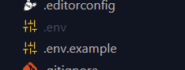

# Football Management REST API
Football Management adalah aplikasi REST API dimana ini hanya dibuat untuk melakukan pendataan tim sepakbola.


## Instalasi

1. Jalankan composer install
```
composer install
```

2. Duplikat .env.example dan ubah namanya jadi .env, contoh seperti berikut ini



## Cara menjalankan aplikasi

Tuliskan perintah berikut pada terminal
```
php -S localhost:8000 -t public
```